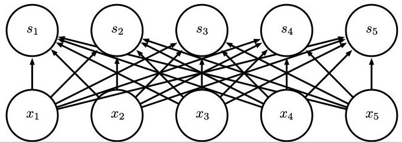

[TOC]

# Convolutional Neural Network

## What is convolution?

​        举DL书中的例子，假设在太空中我们用一个激光传感器追踪一艘飞船的位置。传感器提供一个简单的输出$x(t)$，标识飞船在时刻$t$的位置。由于传感器受到噪音的影响，对飞船位置的评估不够精确，我们可以考虑对几次测量做加权求和。因此，需要一个权重函数$w(a)$，最终的评估表示为：
$$
\Large{
  s(t) = \int x(a) w(t-a)da
}
$$
上式就是一个卷积操作，通常表示为：
$$
\Large{
  s(t) = (x*w)(t)
}
$$
​        更一般来讲，只要上面式子中对两个函数的积分存在，就称为卷积操作。

​        具体到离散的情形，积分符号修改为求和符号即可：
$$
\Large{
  s(t) = \sum_ax(a)w(t-a)
}
$$
​        卷积操作不局限于1维，也可以扩展到2维甚至更高的维度。下图为2维的卷积操作实例：

## Motivations

ideas behind convolution: **sparse connectivity**, **parameter sharing**, **equivariant representation**

### Sparse Connectivity

对比全连接网络（fully connected network），从两个角度看待CNN的稀疏连接性：

（以下的图片中，上部的均为CNN，下部的为FC）

1. 从输出单元来看：对于CNN，只有$s_2, s_3, s_4$三个输出单元与输入$x_3$有关；而对于FC，所有五个输出单元都和$x_3$有关。

2. 从输入单元来看：对于CNN，只有$x_2, x_3, x_4$和输出单元$s_3$有直接联系；而对于FC，所有的输入单元都和$s_3$相连接。

### Parameter Sharing

从图中容易看出，对于CNN，在做卷积操作得到输出单元的时候，每个输出单元都是共享权值$a, b$的；而对于FC，每条从输入单元到输出单元的连接都是使用不同的权值（连接数太多，没有标对应的字母）

### Equivariant Representation

​       在理解这个性质之前，首先要弄清楚什么是等变化的变换(Equivariant Transformation)。简单来说，如果$f(g(x)) = g(f(x))$，那么函数$f$对$g$就是等变化的。通俗来讲，就是完成一件事有两个步骤a和b，先做a再做b和先做b再做a结果都一样。

​        卷积操作对**某些变换**就是等变化的。比如平移操作，你先平移，然后再对图像做卷积，和先卷积再平移，得到的结果是一样的。再者，对于一些时序数据，卷积操作可以保持数据内在的时间线，这个性质对于特定的任务会有帮助。

## Basics

### Convolution

​        具体操作前面已经描述，这里不再赘述。对于图片（比如RGB类型），一般表示为**宽度 * 高度 * 通道数**的三维张量。一般地，滤波器的通道数和输入的通道数一致。

### Stride

### Padding

​        前面介绍的卷积操作有一个不太期望的后果，就是输出的维度逐层减小，严重影响网络的表示能力。特别对于一些比较大的滤波器（还不考虑stride因素），网络输出规模下降得特别厉害。padding可以很好地弥补这种损失。padding操作在输入张量的外围填充相应数量的0值，具体有三种填充策略：**valid，same和full padding**。

- VALID：实质就是不填充的意思，所有的输出单元都由原有的输入单元卷积得到
- SAME：填充适当的0使得输入和输出的维度恰好一致，此时，位于边界的像素点（相比位于中部的）影响较少的输出单元
- FULL：最极端的一种填充，在每个维度都填充足够数量的0，使得每个输入单元在不同的方向都被访问了k次，k为滤波器的高度。比如对于3*3的滤波器，FULL填充就是在图片的上下左右都填充2层的0。

​       上面的讨论都假设步长stride为1的情形，因为如果stride不为1，就算是stride的填充方式得到的输出维度也和输入不一致。再者，不同的框架对这些填充策略都有不同的实现，比如Tensorflow就不支持full填充。具体的输出维度计算可以查看相应的文档。

### Activation

​       卷积层使用的激活函数和多层感知机差不多，一般都为ReLU。

### Pooling

池化是进行下采样的方式之一。DL书中的原话：

> A pooling function replaces the output of the net at a certain location with a summary statistic of the nearby outputs.

 一般的pooling操作有：max pooling、average pooling等。下图为max pooling操作

 池化的作用：

- invariant to small translations of the input：可以通过一个例子来说明这个性质（下图），考虑max pooling的情形，（上）修改前的pooling输出；（下）把所有的输入都往右移动一个单元，现在所有的输入单元都变化了，但输出单元只有两个（最左的和最右的）发生了变化。

  

- computation efficiency: 池化层降低了输出规模，可以一定程度上减小后面全连接层的计算负担

- handling varing input size: 可以通过一定的池化策略处理不同维度的图片输入，比如把图片的激活值分割为4个相同大小的方块，然后在每个方块内做max操作，这样无论什么样的输入都可以得到2*2的输出

​        **有一点要注意的，池化对每个feature map的操作都是独立的。**具体而言，对于10 * 32 * 32的输入实施2 * 2，stride为2的池化操作，输出结果为10 * 16 * 16.

## Neuroscientific Basis for CNN

​       卷积神经网络也是从生物神经科学借鉴而来的。科学家拿猫做了相应的实验，研究猫的视网膜神经对不同图像（如不同关照、不同角度、形状的等图片）兴奋程度，结果发现前部（即更接近于原始图像）的视觉神经系统只对某些特定的光照模式进行响应，像特定偏角的光条等，但对其他光照模式却表现的很沉寂。后面的研究通过回归的方式拟合神经元的权值，发现较低层的视觉神经元的行为与一类称为gabor function的行为很想象。

### Gabor functions

​       具体而言，就是这些神经元的权值取自一个Gabor function:
$$
\Large{
  w(x, y) = \alpha \text{exp}(-\beta_xx'^2 - \beta_yy'^2)\text{cos}(fx'+\phi)
}
$$
​       其中，
$$
\Large{
\begin{split}
  x' &= (x - x_0)\text{cos}(\tau) + (y - y_0)\text{sin}(\tau)\\
  y' &= -(x-x_0)\text{sin}(\tau) + (y - y_0)\text{cos}(\tau)
\end{split}
}
$$
​        其中的参数$\alpha,x_0, y_0, \beta_x, \beta_y, f, \theta, \tau$决定了这个Gabor fucntion的性质。把这些个滤波器可视化出来，就是下面这个样子（调节上面的8个参数）：

​       同样地，如果我们把CNN或者其他一些机器学习算法学习到的滤波器可视化出来，是下面这个样子的：

​        这表明CNN的确在某种程度上模拟视觉系统识别物体的动态过程。

## Terminology

- filter/kernel: 用来做卷积操作的权值矩阵
- feature map: 一个滤波器与输入做卷积操作得到的激活值矩阵称为一个feature map
- receptive field: 感受野，即滤波器的大小，具体到对图片而言，就是与滤波器有直接或者间接关联的图片区域

## Q&A

【TODO】