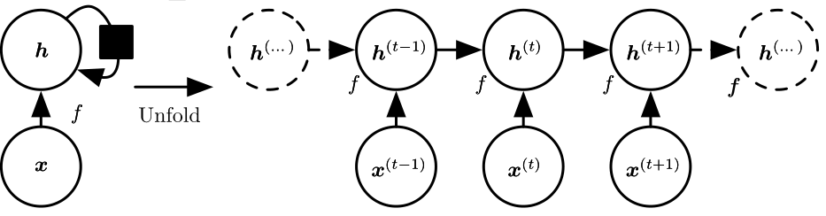
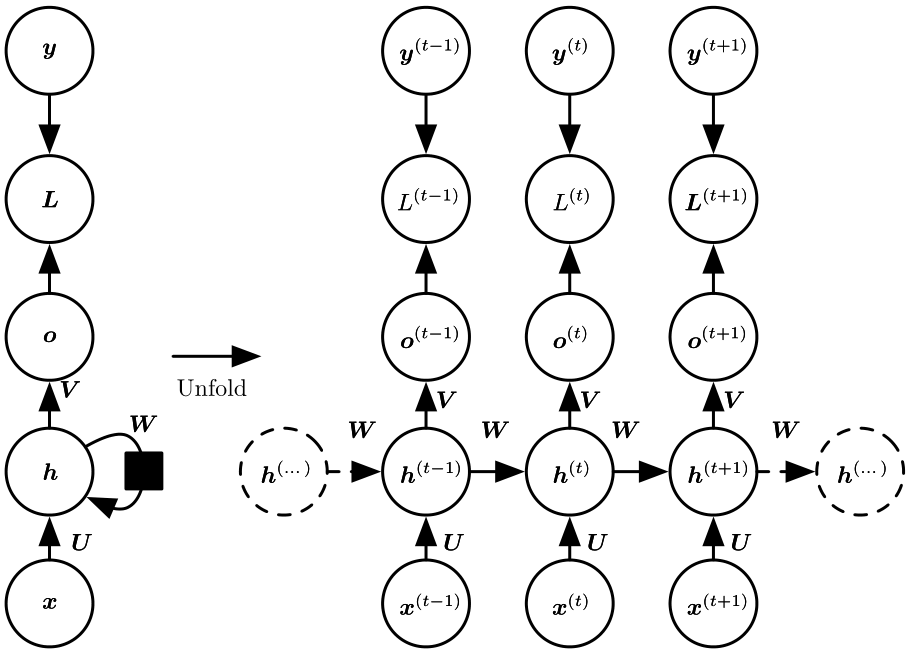
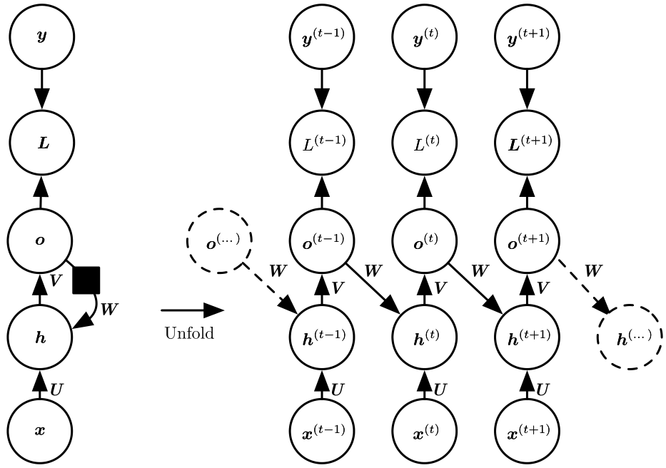
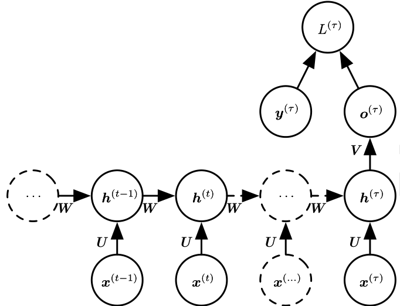
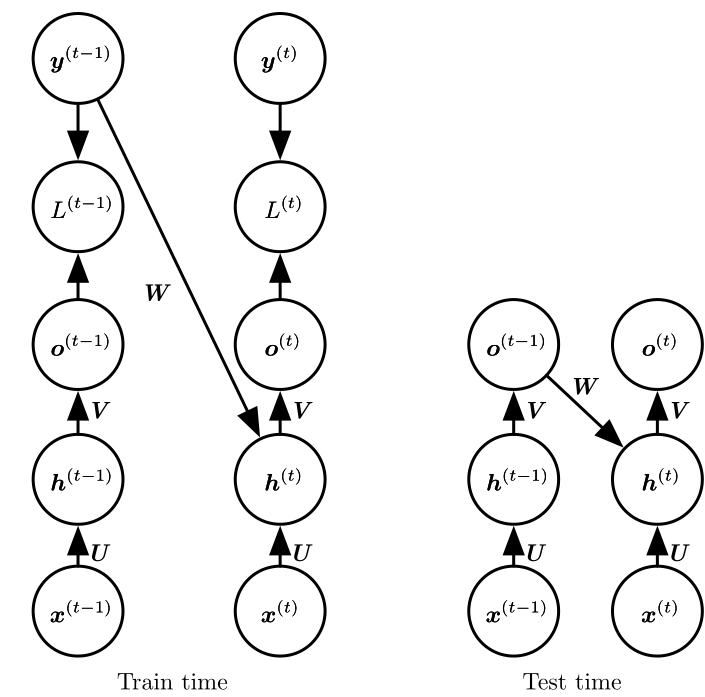
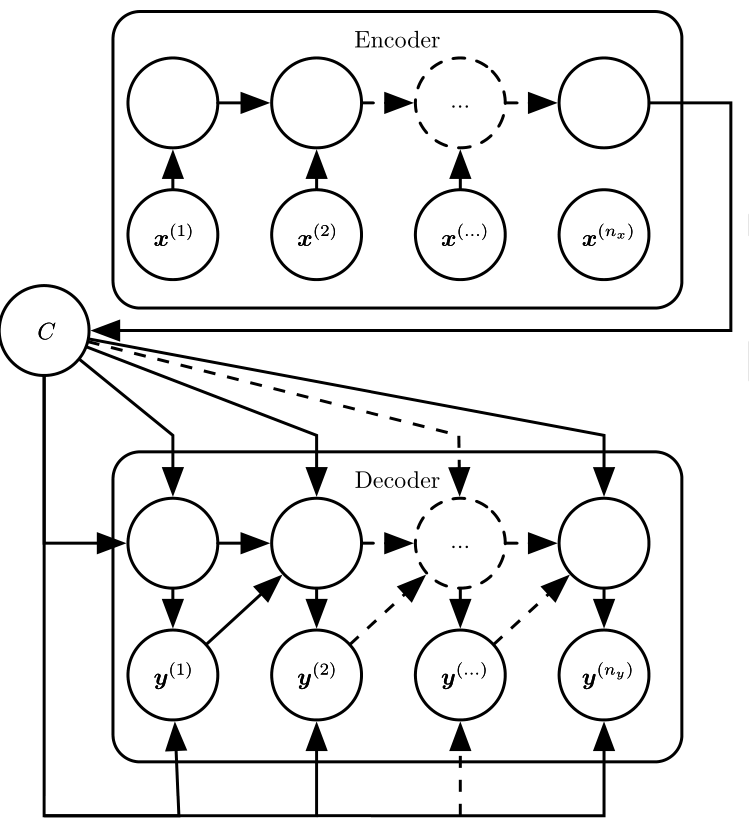
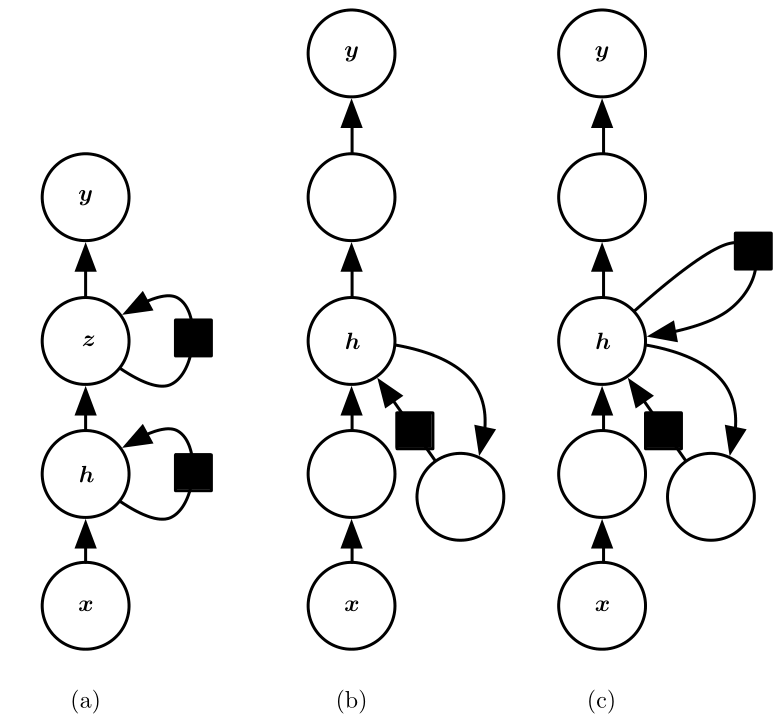
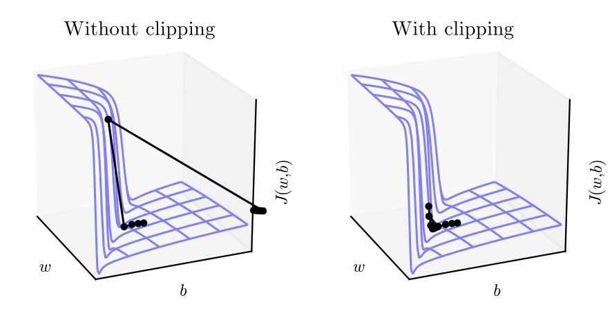

[TOC]

# Recurrent Neural Network

RNN还是借鉴了parameter sharing的思想。与CNN不同，RNN在不同的时间步共享权重，着重捕捉当前输出与不同时间步输入的依赖关系。

## Unfolding Computational Graphs

考虑动态系统的经典形式：
$$
\Large{
  s^{(t)} = f(s^{(t -1)};\theta)
}
$$
$s^{(t)}$指系统在时刻t的状态。

考虑$t=3$的情形，很容易将这种递归的形式扩开成最原始的形式：
$$
\Large{
  \begin{split}
  s^{(3)} & = f(s^{(2)}; \theta)\\
              & = f(f(s^{(1)}; \theta);\theta)
  \end{split}
}
$$
虽然显得冗余，但这种形式显示得表明了为求得$s^{(3)}$的具体操作。

类似地，可以考虑RNN（无输出）的形式：
$$
\Large{
  h^{(t)} = f(h^{(t-1)}, x^{(t)};\theta)
}
$$
$x^{(t)}$为RNN每个时刻的输入，$h^{(t)}$表明时刻t网络的隐含状态。

我们可以把递归结构展成对应的计算图谱：

<center></center>

（黑色正方形表示一个时间步的延迟）

展开的计算图谱有几点好处：

1. 可以清楚地知道具体的操作（前向的）；
2. 容易知晓梯度的流动（后向的）。

## Design Pattern

递归神经网络中的“递归”可以通过不同的形式实现，下面总结3种常见的设计模式，并且引入输出单元。

- 每个时刻均有输出，只在隐藏单元之间有递归连接(sequence -> sequence)

  <center></center>

- 每个时刻均有输出，只在输出单元与隐藏单元之间有递归连接(sequence -> sequence)

  <center></center>

- 仅在最后一个时刻有输出，只在隐藏单元之间有递归连接(sequence -> vector)

  <center></center>


## Training 

根据不同的递归结构，可以有不一样的训练方式。如果只是在输出单元和隐藏单元有递归连接，可以使用一种称为Teacher Forcing的技巧并行地计算梯度。如果涉及了隐藏单元之间的递归连接，只能使用BPTT（Back-propagation Through Time）的方式计算梯度。

### Teacher Forcing

<center></center>

适用情形：输出单元到隐藏单元有递归连接的模型

具体细节：如图，在训练期间，把真实标签（ground truth）作为下一时刻的输入；测试期间，由于没有真实标签，所以把模型的上一时刻的输出当作输入

优点：后向传播的时候不需要沿着时间方向计算相应的梯度，这样每个时刻的导数计算是独立的，可以并行计算

缺点：这样的递归连接构造的网络容量有限，因为输出单元旨在捕捉有助于正确预测输出的信息，所以不太可能形成对历史输入的有效摘要。

> 只要在输出单元和隐含单元有递归连接，Teacher Forcing的方法都适用。只是如果还涉及隐含单元之间的递归连接，还要结合BPTT才能求出完整的梯度。

### BPTT

Back-Propagation Through Time：简单来说还是后向传播，但由于RNN共享权重的形式，需要沿着时间轴反向计算梯度。

考虑常见三种设计模式中的第一种，它的逻辑可以描述为：
$$
\Large{
  \begin{split}
  a^{(t)} &= h^{(t-1)}W_{hh} + x^{(t)}W_{xh} + b_h\\
  h^{(t)} &= \text{tanh}(a^{(t)})\\
  o^{(t)}&=h^{(t)}W_{ho} + b_o\\
  \hat{y}^{(t)} &=\text{softmax}(o^{(t)})\\
  \end{split}
}
$$
假如我们使用交叉熵作为损失函数，那么总的损失为：
$$
\Large{
  \begin{split}
  L^{(t)}& = -\text{log}(p_{\text{model}}(y^{(t)}|\{x^{(1)}, .., x^{(t)}\}))\\
  L &=\sum_{t=0}^\tau L^{(t)}
  \end{split}
}
$$
损失函数对每个时刻的损失的梯度为：
$$
\Large{
\begin{split}
  \frac{\partial L}{\partial L^{(t)}} & = 1
  \end{split}
}
$$
接下来求对输出的梯度（其实就是cross-entropy + softmax的梯度）：
$$
\Large{
  (\nabla_{o^{(t)}}L)_i =\frac{\partial L}{\partial L^{(t)}} \frac{\partial L^{(t)}}{\partial o^{(t)}_i} = \hat{y_i}^{(t)} - 1_{i, y^{(t)}}
}
$$
有了对输出的梯度，然后我们可以求对输出参数$W_{ho}$的梯度，由于共享参数的原因，我们需要把每个时刻的梯度都累加起来，得到：
$$
\Large{
  \begin{split}
  \nabla_{W_{ho}^{(t)}}L & = \frac{\partial L}{\partial o^{(t)}}\frac{\partial o^{(t)}}{\partial W_{ho}} = (h^{(t)})^T(\nabla_{o^{(t)}}L)\\
  \nabla_{W_{ho}}L &= \sum_{t=1}^{\tau} \nabla_{W_{ho}^{(t)}}
  \end{split}
}
$$
接着求隐含单元的梯度，注意在正向传播的时候，$h^{(t)}$有两条分支：$h^{(t)}->h^{(t+1)}$和$h^{(t)}->o^{(t)}$，所以反向计算梯度的时候要都考虑到：
$$
\Large{
  \begin{split}
  \nabla_{a^{(t+1)}}L &= \frac{\partial L}{\partial h^{(t+1)}}\frac{\partial h^{(t+1)}}{\partial a^{(t+1)}} = (\nabla_{h^{(t+1)}}L)\bullet (1 - (h^{(t+1)})^2)\\
  \nabla_{h^{(t)}}L&=\frac{\partial L}{\partial a^{(t+1)}}\frac{\partial a^{(t+1)}}{\partial h^{(t)}} + \frac{\partial L}{\partial o^{(t)}}\frac{\partial o^{(t)}}{\partial h^{(t)}}\\
  &= (\nabla_{a^{(t+1)}}L)W_{hh}^T + (\nabla_{o^{(t)}}L)W_{ho}^T\\
  &\bullet \text{ stands for element-wise multiplication}
  \end{split}
}
$$
同样地，可以求对$W_{ho}$和$W_{xh}$的梯度：
$$
\Large{
  \begin{split}
  \nabla_{W_{ho}} &=\sum_{t} \frac{\partial L}{\partial a^{(t+1)}} \frac{\partial a^{(t+1)}}{\partial W_{ho}^{(t)}} = \sum_{t}(a^{(t+1)})^T(\nabla_{a^{(t+1)}}L)\\
  \nabla_{W_{xh}} &= \sum_{t} \frac{\partial L}{\partial a^{(t+1)}} \frac{\partial a^{(t+1)}}{\partial W_{xh}^{(t)}} = \sum_{t}(x^{(t)})^T(\nabla_{a^{(t+1)}}L)\\
  \end{split}
}
$$

## Ways to Sample from RNN

有几种比较常用的采样方法：

1. 设计特殊的结束标记符：像image caption类的任务，可以在词库中添加一个特殊的标识，表明序列的结束
2. 引入额外的二元输出单元｛0， 1｝：一般为sigmoid输出单元，可以使用交叉熵损失训练，用来标识是否结束取样
3. 直接预测序列的长度$\tau$：比如先预测序列长度为$\tau$，然后从模型中采样$\tau$次

## Encoder-Decoder Architectures

前面的三种网络设计模式可以实现同样长度的序列映射和序列到向量的映射，但做不到不同长度的序列映射。具体的应用场景有：语音识别、机器翻译、问答系统等。encoder-decoder（或者叫sequence-sequence）的结构可以解决这个问题。

encoder-decoder结构一般由两部分组成：

1. encoder（或者称为input RNN）读入每个时刻的输入$X=\{x^{(1)},...,x^{(n_x)}\}$，生成输入序列的一个上下文摘要$C$，这个摘要通常是最后一个时刻的隐含状态的函数；
2. decoder（或者称为output RNN）利用这个固定长度的上下文信息$C$，生成输出序列$Y=\{y^{(1)}, y^{(2)}, ..., y^{(n_y)}\}$。

<center></center>

还有一个问题要解决，如何在decoder注入我们的上下文信息？有两种方法：

- 用上下文$C$初始化decoder的隐含单元
- 把$C$作为decoder每个时刻的输入

## How to Deepen RNN?

通常一个RNN可以分为如下3部分：

1. 输入到隐含单元的变换；
2. 隐含单元（t->t+1）的变换；
3. 隐含单元到输出的变换；

前面提到的网络架构都只是使用了**矩阵相乘**+**激活函数**的简单变换（相当于MLP的一层），因此可以在这3个维度增加网络的深度。

<center></center>

- 图a)，把隐含单元分割成两部分，形成层级结构
- 图b)，在RNN的3个部分都引入了更深层的计算（input->hidden, hidden->hidden, hidden->output）
- 图c)，通过增加跳跃连接的方式缩短信息流动的最短路径（隐含单元没有添加t->t+1时刻的残差连接的话，$h^{(0)}$到$h^{(t)}$的最短连接路径为$kt$，$k$为t->t+1的网络深度；添加以后最短路径缩短为$t$）

## Ways to Help with Training

有时候，我们希望尽可能地提升RNN的序列长度来捕捉尽可能久远的信息，但带来的问题是RNN的训练越来越困难。如果**不考虑激活函数**的作用，RNN的复合函数结构类似于矩阵的连乘操作：
$$
\Large{
\begin{split}
  h^{(t)} &= h^{(t-1)}W\\
  &= h^{(0)}W^t
  \end{split}
}
$$
如果$W$有如下的特征值分解形式：
$$
\Large{
  W = Q^T\Lambda Q
}
$$
那么$t$时刻的隐含单元值为：
$$
\Large{
  h^{(t)} = h^{(0)}Q^T\Lambda^tQ
}
$$
矩阵$W$的**谱半径**$\rho$定义为绝对值最大的特征根，它决定了矩阵连乘的最终结果是shrink还是explode。

- $\rho < 1$，shrink
- $\rho > 1$，explode

矩阵连乘类似于对一个初始量$x_0$连续乘上相同的缩放因子$w$，$w$大于1最终结果趋近于无穷大，而$w$小于1则结果趋近于0.

这样不仅可能阻碍模型中信息的流动，还可能造成训练不稳定或者训练及其缓慢的困境。下面是一些改进的方法。

### Gradient Clipping

<center></center>

RNN的递归操作使得在网络训练的时候经常遇到“悬崖”的结构（如图），即函数在该处的偏导数特别大。偏导数只是告诉我们在某个邻域范围内，函数值沿着该方向有所下降，一旦超出了这个邻域范围，偏导数不再具有“指导”意义。对于像使用偏导数进行迭代优化的方法（比如SGD），如果选取的学习律不合适的话，极有可能造成overshooting的后果。

一个解决梯度爆炸很实用的方法就是截断梯度（Clipping Gradient），一般有两种形式：

- clip by value：按元素截断梯度，截断超出[min, max]范围的梯度
- clip by norm：如果梯度$g$的范数（一般为2范数）超过某个阈值$v$，按如下方式截断：

$$
\Large{
  g = \frac{gv}{||g||}
}
$$

```python
# gradient clipping in Tensorflow
tf.clip_by_value(t, clip_value_min, clip_value_max, name=None)

# axes: 表明要计算范数的方向
tf.clip_by_norm(t, clip_norm, axes=None, name=None)
```

> DL书中还提到，如果梯度超过某个阈值的时候，随机游走的方式都有很好的效果。比如某些特别严重的情况下，梯度的值为Inf或者NaN，随机更新的方式有很大可能脱离数值不稳定的区域。

### Skip Connection

### ESN

### LSTM


