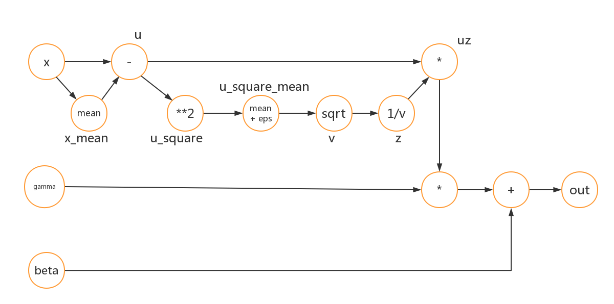
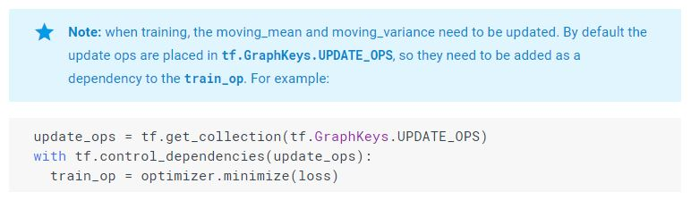

[TOC]

# Batch Normalization

## Algorithm

$$
\Large{
\begin{split}
  \text{Input}: & \text{Values of a mini-batch,} X = \{x^{(1)}, x^{(2)}, ..., x^{(m)}\};\\
   & \text{paramters to be learned, } \gamma \text{ and } \beta.\\
   \text{output}: & \text{normalized output, }Z =\{z^{(1)}, z^{(2)}, ...,z^{(i)}\}
\end{split}
\\
\begin{split}
  \mu &\leftarrow \frac{1}{m}\sum_i x^{(i)} \\
  \sigma^2 & \leftarrow \frac{1}{m}\sum_i(x^{(i)} - \mu)^2\\
  y^{(i)} &\leftarrow\frac{x^{(i)} - \mu}{\sqrt{\sigma^2 + \epsilon}}\\
  z^{(i)} &\leftarrow \gamma y^{(i)} + \beta
\end{split}
}
$$

## Implementation

### Computational Graph

<center></center>

### Detail

- 添加eps是避免$f(z) = \sqrt z$ 在0处导数不存在的情况

```Python
def batchnorm_forward(x, gamma, beta, bn_param):
    mode = bn_param['mode']
    eps = bn_param.get('eps', 1e-5)
    momentum = bn_param.get('momentum', 0.9)

    N, D = x.shape
    running_mean = bn_param.get('running_mean', np.zeros(D, dtype=x.dtype))
    running_var = bn_param.get('running_var', np.zeros(D, dtype=x.dtype))

    out, cache = None, None
    if mode == 'train':
        x_mean = np.mean(x, axis=0)
        u = x - x_mean
        u_square = u**2
        u_square_mean = np.mean(u_square, axis=0) + eps
        v = np.sqrt(u_square_mean)
        z = 1.0 / v
        uz = u * z
        out = gamma * uz + beta
        cache = (x_mean, u, u_square, u_square_mean, v, z, uz, gamma)

        running_mean = momentum * running_mean + (1 - momentum) * x_mean
        running_var = momentum * running_var + (1 - momentum) * u_square_mean
    elif mode == 'test':
        xx = (x - running_mean) / np.sqrt(running_var)
        out = gamma * xx + beta
    else:
        raise ValueError('Invalid forward batchnorm mode "%s"' % mode)

    bn_param['running_mean'] = running_mean
    bn_param['running_var'] = running_var
    return out, cache
```

```Python
def batchnorm_backward(dout, cache):
    dx, dgamma, dbeta = None, None, None
    N, D = dout.shape
    x_mean, u, u_square, u_square_mean, v, z, uz, gamma = cache
    dbeta = np.sum(dout, axis=0)
    dgamma = np.sum(dout * uz, axis=0)
    duz = dout * gamma
    dz = np.sum(duz * u, axis=0)
    dv = dz * (-1.0 / v**2)
    du_square_mean = dv * 1.0 / (2 * v)
    du_square = du_square_mean / N
    du = duz * z
    du += du_square * (2 * u)
    dx_mean = -np.sum(du, axis=0)

    dx = np.zeros_like(dout)
    dx += du
    dx += dx_mean / N
    return dx, dgamma, dbeta
```

## Why would it work?

可以看一下这个[Thread](https://www.quora.com/Why-does-batch-normalization-help)，个人觉得下面的这个解释比较容易理解和合理一点

Batch normalization (BN) solves a problem called internal covariate shift, so to explain why BN helps you’ll need to first understand what covariate shift actually is…

“Covariates” is just another name for the input “features”, often written as X. **Covariate shift** means the distribution of the features is different in different parts of the training/test data, breaking the i.i.d assumption used across most of ML. This problem occurs frequently in medical data (where you have training samples from one age group, but you want to classify something coming from another age group), or finance (due to changing market conditions).

**Internal covariate shift** refers to covariate shift occurring within a neural network, i.e. going from (say) layer 2 to layer 3. **This happens because, as the network learns and the weights are updated, the distribution of outputs of a specific layer in the network changes. This forces the higher layers to adapt to that drift, which slows down learning.**

BN helps by making the data flowing between intermediate layers of the network look like whitened data, this means you can use a higher learning rate. Since BN has a regularizing effect it also means you can often remove dropout (which is helpful as dropout usually slows down training).

1. 由于神经网络的更新是所有层同步更新的，但偏导数只是表明单个参数往那个方向更新会有下降，同步更新会带来意想不到的结果，特别是像神经网络这种层级的复合函数，低层的输入有些微抖动，就可能造成高层的输出波动误差特别大，这样造成网络的训练特别不稳定
2. BN在网络训练早期可以把任何形式的输入都转换为zero mean/unit variance的形式，一定程度上缓和了每一层输入的波动，这也是为什么可以使用比较大的学习率的原因之一。

## How does it work?

- faster learning
- higher accuracy in test set(introduce some kind of regularization)
- wider range of acceptable learning rate
- relax the constraint on weight initializtion

## BN in Tensorflow

- 有一点稍微不同：TF里的moving_var是用1初始化的

```Python
training_ph = tf.placeholder(tf.bool, shape=[])
out = tf.layers.batch_normalization(inputs=x,
                                   training=training_ph,
                                   epsilon=1e-5.
                                   momentum=0.9)
```

**文档里有个坑的地方，moving_mean和moving_var的更新是放在tf.GraphKeys.UPDATE_OPS里面的**

<center></center>

也就是说假如自己想单独测试一下BN的话，下面的代码运行后，在测试模式检验输出发现没有预期0均值1方差的效果，原因就是moving mean和var是没有被更新的，把带箭头的代码去掉注释就好了

```Python
# simple network with 2 layers
tf.reset_default_graph()
training_ph = tf.placeholder(tf.bool, shape=[])
tf_w1 = tf.constant(W1, dtype=tf.float32)
tf_w2 = tf.constant(W2, dtype=tf.float32)
X_ph = tf.placeholder(tf.float32, shape=[N, D1])
tf_1 = tf.maximum(0.0, tf.matmul(X_ph, tf_w1))
tf_2 = tf.matmul(tf_1, tf_w2)
bn = tf.layers.batch_normalization(inputs=tf_2,
                                  epsilon=1e-5,
                                  training=training_ph,
                                  momentum=0.9)
# -> update_op = tf.get_collection(tf.GraphKeys.UPDATE_OPS)
with tf.Session() as sess:
    tf.global_variables_initializer().run()
    for t in range(50):
        X = np.random.randn(N, D1)
        feed_dict = {
            X_ph: X,
            training_ph: True
        }
        sess.run(bn, feed_dict)
        # -> sess.run(update_op, feed_dict)
        
    X = np.random.randn(N, D1)
    feed_dict = {
        X_ph: X,
        training_ph: False
    }
    out = sess.run(bn, feed_dict)
    
    # Means should be close to zero and stds close to one, but will be
    # noisier than training-time forward passes.
    print('After batch normalization (test-time):')
    print('tf  means: ', out.mean(axis=0))
    print('tf  stds: ', out.std(axis=0))
```

